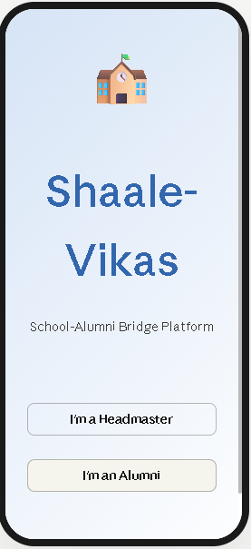
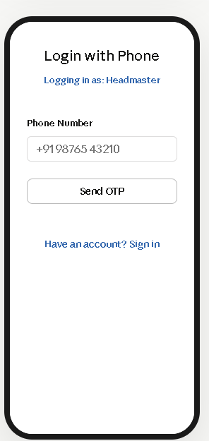
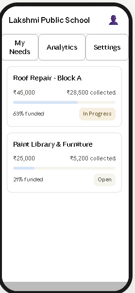
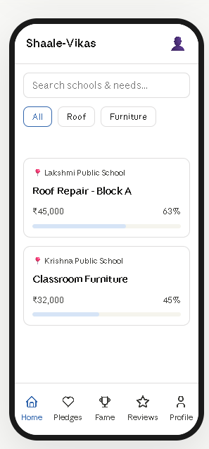
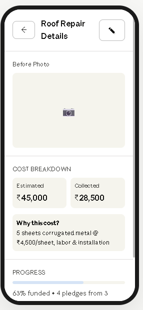
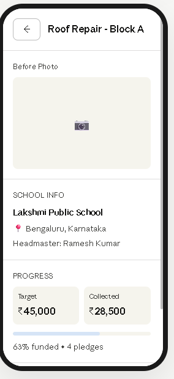
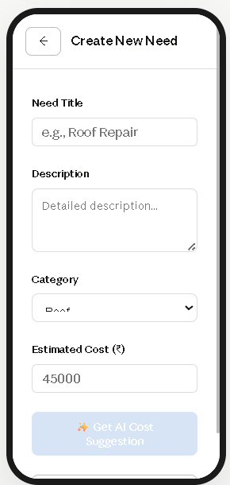
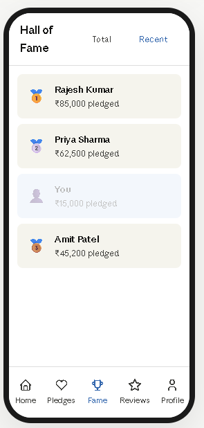

# Shaale-Vikas Android App

**Shaale-Vikas** is a School-Alumni Bridge Platform built with Kotlin, Jetpack Compose, and Firebase. The app connects headmasters and alumni to raise funds for school needs like repairs, furniture, and learning resources.

## Project Overview

- **Role-based app** for Headmaster and Alumni users
- **Firebase Phone Authentication** for secure login
- **Firestore** collections for users, needs, pledges, and leaderboard
- **Firebase Storage** support for need photos
- **Cloud Functions** for cost suggestions and pledge aggregation
- **Demo fallback mode** when Firebase is not configured

## Features

- Headmaster and alumni login via phone number
- Create and manage school needs with cost estimates
- Track funding progress for each need
- View leaderboard / Hall of Fame for top pledges
- Search and filter needs by category
- View need details, cost breakdown, and funding status

## Tech Stack

- Kotlin
- Jetpack Compose
- Firebase Authentication
- Firebase Firestore
- Firebase Cloud Functions
- Firebase Storage
- Gradle

## Setup and Run

1. Clone this repository.
2. Open the project in Android Studio.
3. Add `app/google-services.json` from your Firebase project.
4. Enable Firebase Authentication > Phone provider.
5. Enable Cloud Firestore and Firebase Storage.
6. Sync Gradle and build the project.

### Firebase deployment

- If you want to deploy backend rules and functions, install Firebase CLI.
- Run:

```bash
firebase deploy --only firestore:rules,storage,functions
```

## Screenshot Gallery

1. **App welcome / role selection**

   

2. **Phone login**

   

3. **Headmaster dashboard**

   

4. **Needs list**

   

5. **Cost breakdown detail**

   

6. **Need detail view**

   

7. **Create new need**

   

8. **Hall of Fame**

   

## Documentation

- See [PROJECT_EVALUATION_CRITERIA.md](PROJECT_EVALUATION_CRITERIA.md) for the automated project evaluation guidance used by Team MindMatrix.

## Notes

- Keep the repository public until evaluation is complete.
- Do not commit large generated build files or local Firebase config files.

## License

This project is licensed under the MIT License. See [LICENSE](LICENSE) for details.
